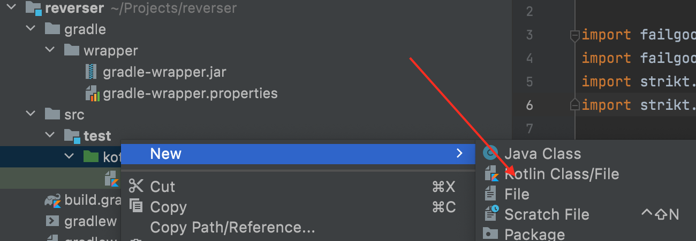
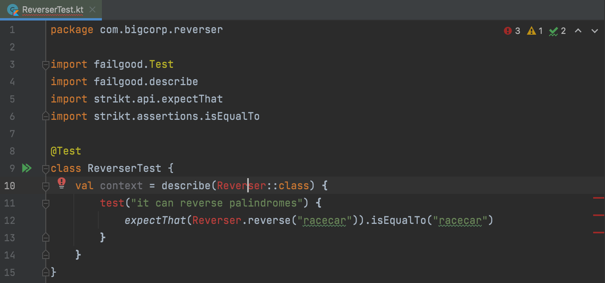
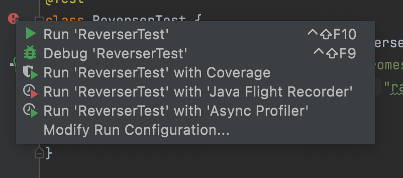
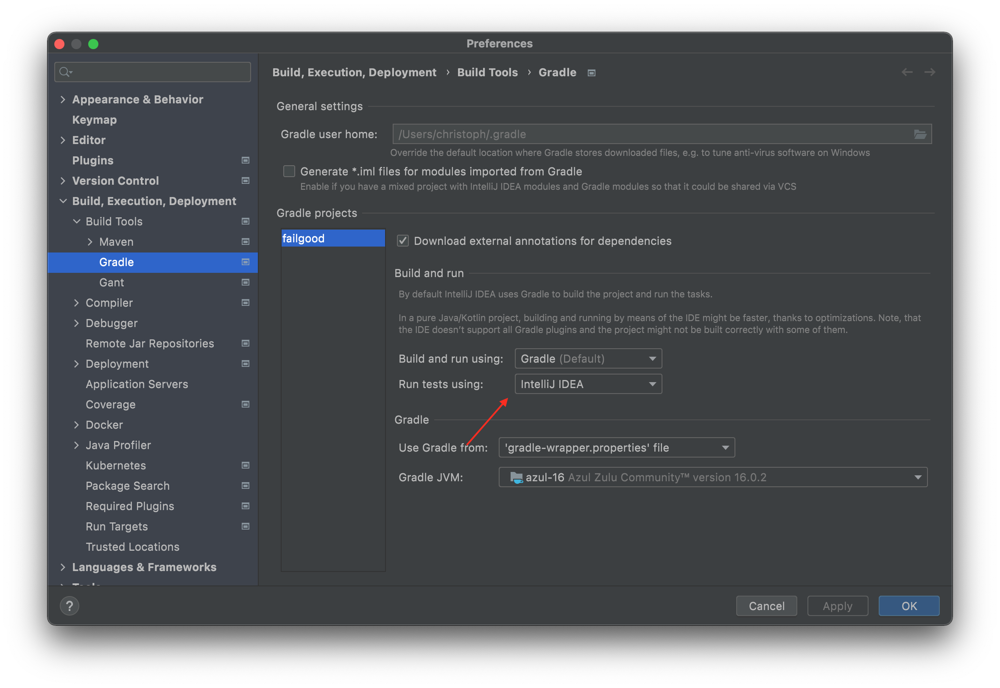
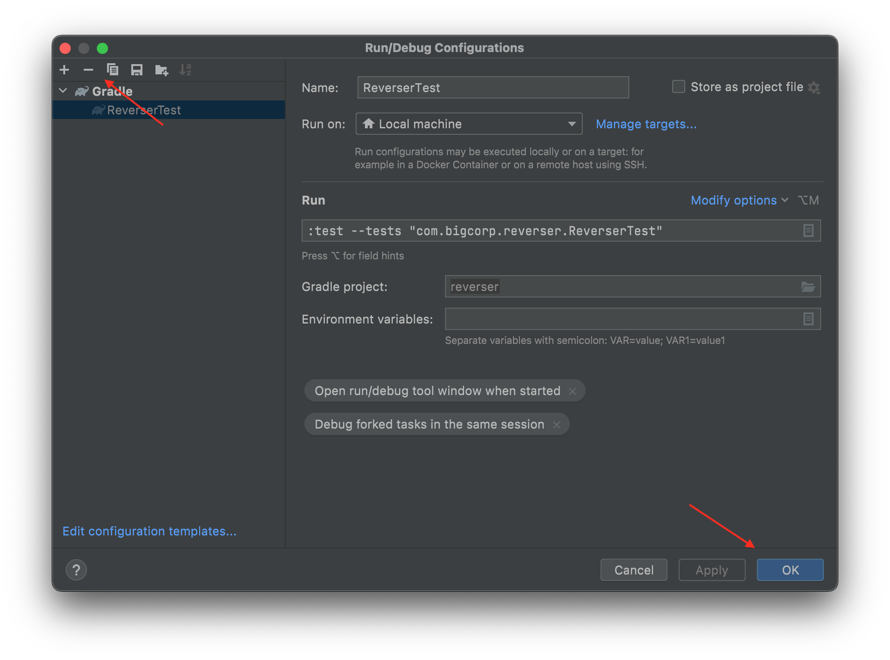
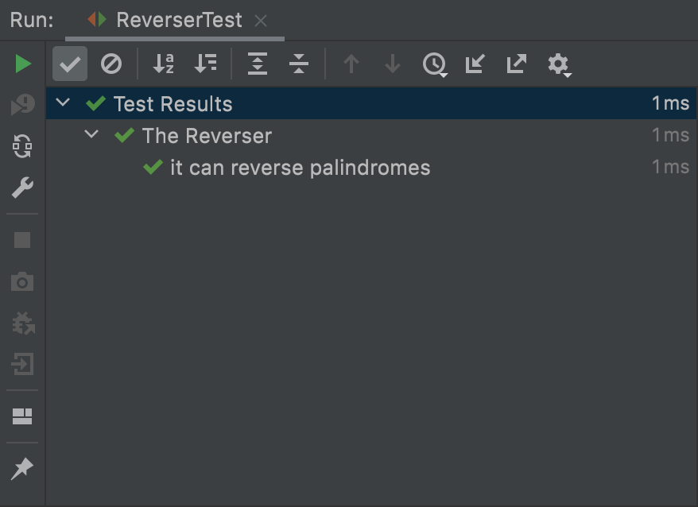

md title="docs/hello.md" {1-4}
---
sidebar_label: 'Installing' sidebar_position: 3
---

# First Steps

Let's say your job is to build a library that can reverse palindromes. You want to make sure that your code is really
production ready so you decide to write it using TDD. Also you want to use kotlin because it offers great performance (
JVM), and still just enough functional programming and immutability. But jvm and kotlin libraries are so enterprisey, so
you wonder is there something really lightweight and fast?

Then you find Failgood. It has all the upsides of the jvm and kotlin but no bloat. This must be the right test runner to
build you string reverser.

you either

### create a new gradle project

create a new directory and paste this into `build.gradle.kts`

```kotlin
plugins {
    kotlin("jvm") version "1.5.30"
}


dependencies {
    testImplementation("dev.failgood:failgood:0.4.6")
    testImplementation("io.strikt:strikt-core:0.32.0")
}

tasks {
    withType<Test> {
        useJUnitPlatform()
    }
}
```

## Open the Project in your favorite IDE

then you open that build file in Intellij IDEA

first you create a directory for your tests according to gradle standards by entering this in IDEAs shell:

`mkdir -p src/main/test/kotlin`

and in that directory you create your first test: Create Kotlin Class: `ReverserTest`


```
package com.bigcorp.reverser

import failgood.Test
import failgood.describe
import strikt.api.expectThat
import strikt.assertions.isEqualTo

@Test
class ReverserTest {
    val context = describe(Reverser::class) {
        test("it can reverse palindromes") {
            expectThat(Reverser.reverse("racecar")).isEqualTo("racecar")
        }
    }
}
```



then you create the stub of the implementation directly in the test file below the test by just using IDEA autofixes (by
pressing alt enter on Reverser::class, selecting create object, and then pressing alt enter on the reverse call, and
creating the method.

this should look like this:

```kotlin
object Reverser {
    fun reverse(s: String): Any {
        TODO("Not yet implemented")
    }
}
```

Now you have a stub implementation of your reverser service and you want to see it fail to make sure your test works. so
you click the green play button left of the @Test annotation and run the test.


Any it really fails, you see this in ideas run window:

```
Execution failed for task ':test'.
> There were failing tests. See the report at: file:///Users/christoph/Projects/reverser/build/reports/tests/test/index.html

* Try:
Run with --stacktrace option to get the stack trace. Run with --info or --debug option to get more log output. Run with --scan to get full insights.

```

This is not really helpful so you go to IDEA Preferences, select gradle settings there and set it to run tests in IDEA (
not in gradle)


Full of hope you press the play button near the @Test annotation again. Sadly it still fails with the same error:

```
Execution failed for task ':test'.
> There were failing tests. See the report at: file:///Users/christoph/Projects/reverser/build/reports/tests/test/index.html

* Try:
Run with --stacktrace option to get the stack trace. Run with --info or --debug option to get more log output. Run with --scan to get full insights.

```

Then you notice the run icon in the upper right and it looks like this:

Hmm that looks like an elephant and an elephant is the logo of gradle. Maybe idea still uses gradle to run the test. So
you click on the run configuration and select "Edit Configurations..."
There you see that indeed idea was still using gradle so you press the - button to delete the gradle run config and then
the ok button of the dialog to confirm the deletion.

Now you click the play button next to the `@Test` Annotation again and finally, your test runs. And as expected it
fails.

So now its time add the real implementation:
You change the implementation to:

```
object Reverser {
fun reverse(s: String) = s.reversed()
}
```

You run the test again, and it passes:


Congratulations you have written your first test with Failgood. I hope you liked it.

Continue to the next tutorial where we will measure mutation coverage with Failgoods pitest plugin. To make sure your
tests are meaningful and really test what you think they do.

